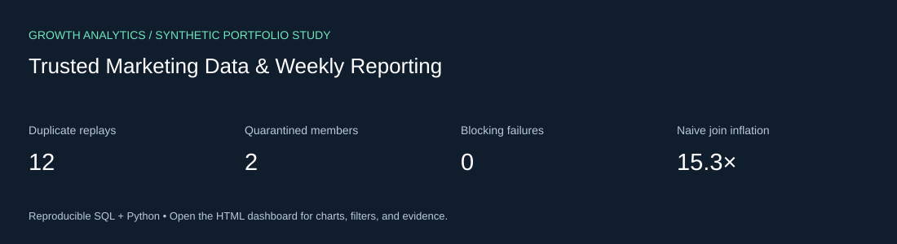

# Trusted Marketing Data & Reporting

Independent, AI-assisted marketing analytics project using **synthetic data** for a fictional fitness subscription business. Findings are simulated and do not represent real campaign results.



## Business question

Build a reconciled acquisition mart with deduplication, quarantine and reporting quality gates.

## Review the result

- [Decision brief](outputs/decision-brief.md): computed findings and business recommendations.
- [Interactive dashboard source](outputs/dashboard.html): download and open locally for charts, view selection, row search, metric selection, and CSV export. GitHub shows HTML source rather than running it.
- [SQL analysis](analysis.sql) and [Python pipeline](run.py).
- [Looker source and setup](bi/README.md), plus [Tableau build guide](bi/TABLEAU.md).

## Run locally

Requires Python 3.10+; **no packages, API keys or paid accounts are needed**.

```bash
git clone https://github.com/jahnavinalla1/marketing-data-quality-reporting.git
cd marketing-data-quality-reporting
python3 run.py
python3 -m unittest discover -s tests -v
```

Open `outputs/dashboard.html` in your browser. Generated data CSVs and the SQLite database are excluded from Git and rebuilt with a fixed seed. Committed output CSVs can be inspected immediately.

## Computed findings — simulated data

- Joining raw member events directly to daily spend would inflate spend by 15.3×. Aggregate facts to date/campaign grain before joining.
- Deduplicate 12 replayed ingestions, exclude one invalid revenue record, and quarantine one unmapped acquisition. Report warnings visibly rather than silently losing records.
- The clean mart reconciles to source spend and eligible distinct members. Release with disclosed warnings; route unmapped campaigns to Marketing Operations and invalid amounts to the source owner.
- Freshness is evaluated against the fixed simulation as-of date 2026-09-29. The recurring run must use a production as-of parameter and an agreed ingestion SLA.

## Deliverables and status

| Deliverable | Status |
|---|---|
| Reproducible SQL/Python analysis | Executable and locally tested |
| Offline interactive dashboard | Generated with embedded computed data |
| Data-quality / numerical tests | See [validation record](VALIDATION.md) |
| Native LookML model, view, dashboard source | Supplied; needs warehouse connection and tenant validation |
| Tableau calculated fields and layout instructions | Supplied; workbook not built or published |
| Business recommendations | Hypothetical; no media spend executed |

The HTML report is the working dashboard. The repository does **not** claim a deployed Looker or Tableau dashboard. LookML is for Looker, not Looker Studio.

## Methods and tools

SQL, marketing measurement, visualization, analytical problem solving, explicit assumptions, business recommendations, and quality-checked AI assistance.

Read [data contracts](DATA-DICTIONARY.md), [AI assistance](AI-ASSISTANCE.md), and [review questions](REVIEW-GUIDE.md).

## Related independent repositories

- [Paid Media Performance & Acquisition](https://github.com/jahnavinalla1/paid-media-performance-analytics)
- [Paid Social Incrementality & Lift](https://github.com/jahnavinalla1/marketing-incrementality-lift)
- [Marketing Investment & Budget Allocation](https://github.com/jahnavinalla1/marketing-budget-optimization)
